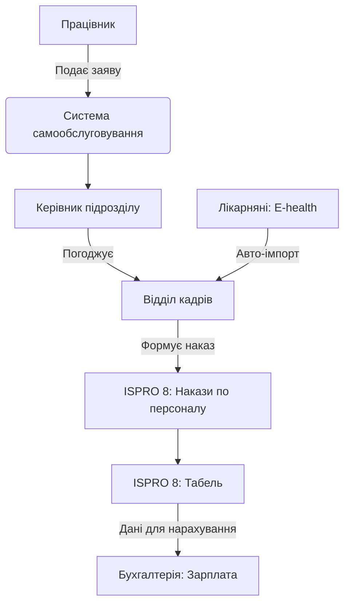

# Облік робочого часу та відпусток (Leave Management)

## 1. Опис процесу
Керування графіками роботи, реєстрація заяв на відпустку, формування табелів обліку робочого часу та їх синхронізація з платіжним модулем ISPRO 8.

## 2. Функціональні вимоги
*   **Заява на відпустку:** Можливість подання заяви через кабінет працівника.
*   **Узгодження:** Багаторівневе узгодження (керівник кафедри/відділу -> деканат -> відділ кадрів).
*   **Контроль залишків:** Автоматичний розрахунок доступних днів відпустки.
*   **Табелювання:** Формування табеля на основі фактично відпрацьованого часу та наказів на відпустки/лікарняні.

## 3. Технічні вимоги
*   **Синхронізація з ISPRO 8:** Використання модуля "Облік робочого часу".
*   **Типи подій:** Робота, Відпустка (щорічна, соціальна, без збереження зп), Лікарняний, Відрядження.
*   **Звітність:** Експорт табеля у форматі, придатному для імпорту в модуль "Заробітна плата" ISPRO 8.

## 4. Діаграма потоку даних (Mermaid)

## 5. Специфікація інтеграції з ISPRO 8
Інтеграція здійснюється через підсистему "Персонал" та "Облік робочого часу". Дані про відсутність повинні автоматично блокувати відповідні дні в табелі.
