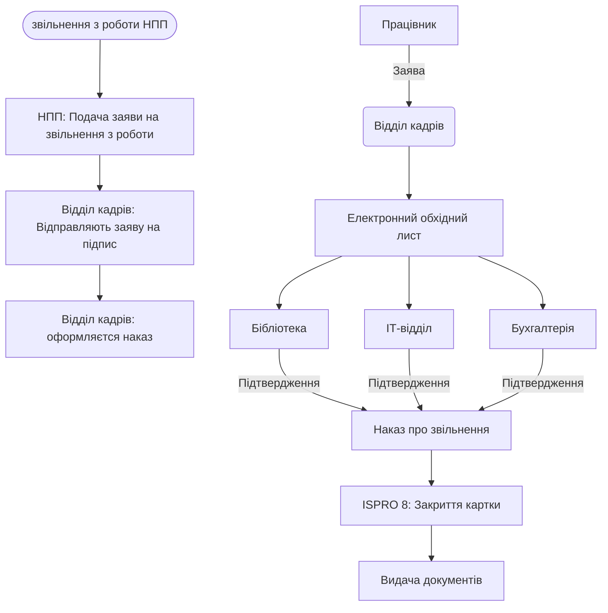

# Процес звільнення (Offboarding)

## 1. Опис процесу
Регламентація дій при припиненні трудових відносин, включаючи підписання обхідного листа, видачу трудової книжки та архівацію даних в ISPRO 8.

## 2. Функціональні вимоги
*   **Заява на звільнення:** Ініціація процесу через заяву працівника або закінчення контракту.
*   **Електронний обхідний лист:** Автоматична розсилка запитів до бібліотеки, АГВ, ІТ-відділу, бухгалтерії.
*   **Наказ про звільнення:** Генерація наказу та передача статусу "Звільнений" в ISPRO 8.
*   **Деактивація:** Автоматичне блокування доступів до внутрішніх ресурсів університету.

## 3. Технічні вимоги
*   **Статуси в ISPRO 8:** Зміна статусу працівника в картотеці "Особовий склад".
*   **Архівування:** Збереження історії нарахувань та наказів.
*   **Експорт даних:** Формування довідки про доходи та стаж.

### Заяву підписують
- Завідувач кафедри
- Декан/Директор інституту
- Навчальний відділ
- розрахунковий відділ
- Ректор
  
## 4. Діаграма потоку даних (Mermaid)

## 5. Специфікація інтеграції з ISPRO 8
Передача дати звільнення та номеру наказу до модуля HRM. Після закриття картки в ISPRO 8, працівник повинен автоматично зникнути з активного табеля.
