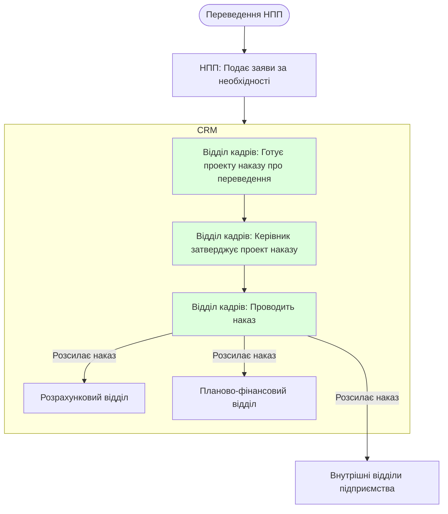

# Переведення НПП

### Перелік необхідних документів

- Заява або ініціатива адміністрації

### Відділ бухгалтерського обліку, фінансової та бюджетної звітності

- Розрахунковий відділ
- Планово-фінансовий відділ

### Внутрішні відділи підприємства

- Навчальний відділ
- Мобілізаційний відділ

#### Діаграма flowchart (short)

