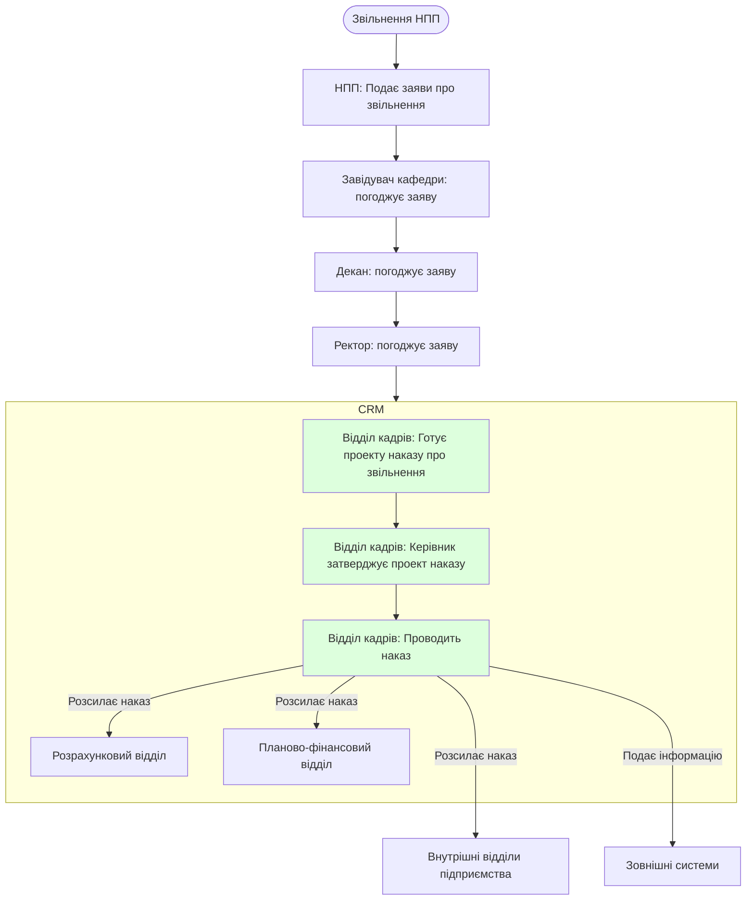

# Звільнення НПП

### Перелік необхідних документів

- Заява про звільнення

### Відділ бухгалтерського обліку, фінансової та бюджетної звітності

- Розрахунковий відділ
- Планово-фінансовий відділ
  
### Зовнішні системи

- ЄДЕБО
- Пенсійний фонд

###  Внутрішні відділи підприємства

- Навчальний відділ
- Мобілізаційний відділ

#### Діаграма flowchart (short)

