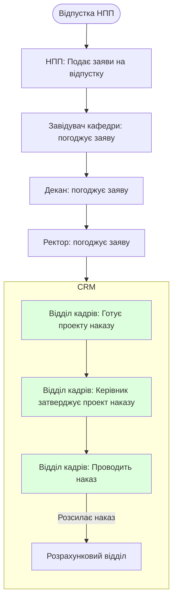

# Відпустка НПП

### Перелік необхідних документів

- Заява на відпустку

#### Діаграма flowchart (short)

```mermaid
flowchart TB
    TITLE(["Відпустка НПП"])
    TITLE --> APPLICATION["НПП: Подає заяви на відпустку"]
    APPLICATION --> APPROVE1["Завідувач кафедри: погоджує заяву"]
    APPROVE1 --> APPROVE2["Декан: погоджує заяву"]
    APPROVE2 --> APPROVE3["Ректор: погоджує заяву"]
    subgraph "CRM"
        direction TB
        APPROVE["Відділ кадрів: Готує проекту наказу"]
        APPROVE --> HEAD_APPROVE["Відділ кадрів: Керівник затверджує проект наказу"]
        HEAD_APPROVE --> PROVODKA["Відділ кадрів: Проводить наказ"]
        PROVODKA  -- "Розсилає наказ" --> V1["Розрахунковий відділ"]
    end
    APPROVE3 --> CRM
style PROVODKA fill: #dfd
style HEAD_APPROVE fill: #dfd
style APPROVE fill: #dfd
```
