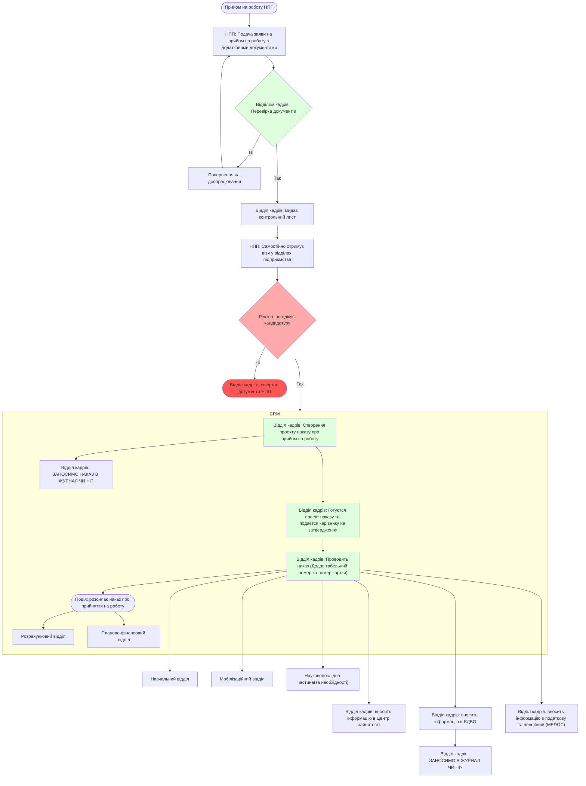
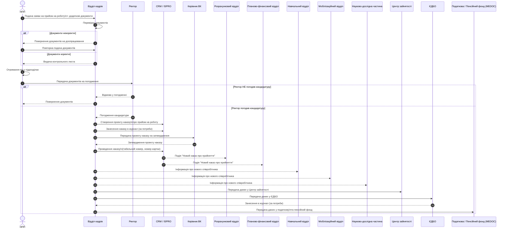

# Приймання на роботу НПП

**Для прийму на роботу необхідно**
1.  Подати заяву про приймання на роботу з додатковими документами до відділу кадрів.
2. 
 
### Перелік необхідних додаткових документів

- Особовий листок
- Автобіографія
- Копії документів про освіту(диплом про вищу освіту та додатлок)
- Паспортні дані
- Ідентифікаційний код
- Медична довідка
- Документи військового обліку (для чоловіків)
- Трудова книжка
- Пенсійна довідка ОК-7
- 2 фотокартки 2х4
- Інші документи (відомство про шлюб, відомство про народження дитини, інвалідність)

### Ведення журналів

**Потрібно зрозуміти, які данні потрібно вносити в журнал?!**

- Журнал вихідної кориспонденції(Податкова/Пенсійний)
- Журнал Особового складу(накази)
**Табельний номер видає бухгалтерія
  
### Відділ бухгалтерського обліку, фінансової та бюджетної звітності

- Розрахунковий відділ
- Планово-фінансовий відділ
  
#### Діаграма flowchart

#### Діаграма послідовності

