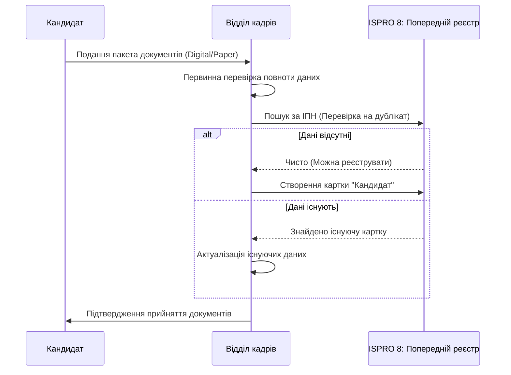
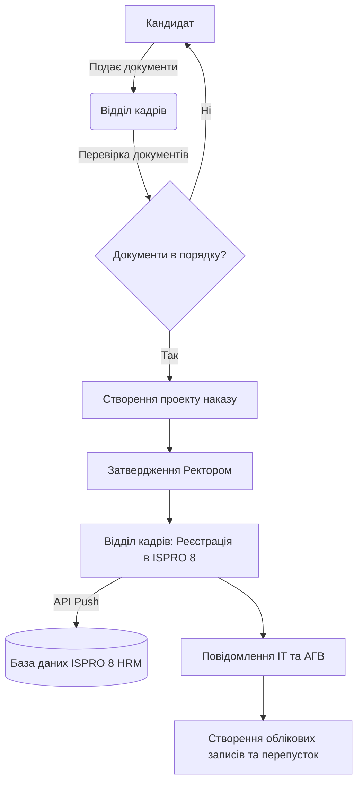

# Процес прийому на роботу (Onboarding)

## 1. Опис процесу
Процес охоплює етапи від подання кандидатом документів до створення запису в системі ISPRO 8 та активації облікового запису працівника в університетських системах.

## 1. Деталізація першого кроку: Подання та перевірка документів
На цьому етапі відбувається первинний контакт кандидата з університетом та формування цифрового досьє.

### 1.1. Перелік обов'язкових документів
Для успішного старту процесу в ISPRO 8 необхідно зібрати наступні дані:
1.  **Паспортні дані:** Скан-копії (або дані з Дії) — ПІБ, серія, номер, ким виданий, дата видачі.
2.  **ІПН:** Реєстраційний номер облікової картки платника податків.
3.  **Документи про освіту:** Дипломи, додатки, наукові ступені та вчені звання.
4.  **Військовий квиток / Приписне:** Обов'язково для військовозобов'язаних.
5.  **Трудова книжка:** (або витяг з електронної трудової).
6.  **Заява про прийняття на роботу:** Власноруч підписана або з використанням КЕП.

### 1.2. Процедура перевірки (Pre-check)
Перед внесенням в ISPRO 8 фахівець ВК здійснює:
*   Перевірку на наявність попередніх записів у системі (контроль дублікатів).
*   Перевірку відповідності кваліфікації вимогам штатного розпису.
*   Валідацію ІПН через державні реєстри (за можливості).

## 2. Функціональні вимоги
*   **Реєстрація кандидата:** Введення персональних даних, паспортних даних, ІПН, документів про освіту.
*   **Генерація наказу:** Автоматичне створення проекту наказу про призначення на посаду.
*   **Інтеграція з підрозділами:** Повідомлення ІТ-відділу про необхідність створення пошти, АГВ про видачу перепустки.
*   **Експорт в ISPRO 8:** Передача структурованих даних до модуля HRM ISPRO 8.

## 3. Технічні вимоги
*   **Формат даних:** JSON/XML для API ISPRO 8.
*   **Тригери:** Затвердження наказу ректором ініціює створення картки в системі.
*   **Поля даних:** Прізвище, Ім'я, По батькові, Дата народження, ІПН, Посада, Кафедра/Відділ, Ставка, Дата початку роботи.

## 4. Діаграма потоку даних (Деталізація першого кроку)

## 5. Загальна діаграма процесу (Mermaid)

## 6. Специфікація інтеграції з ISPRO 8
Дані повинні передаватися до реєстру "Особовий склад". Обов'язкова перевірка на дублікати за ІПН.
