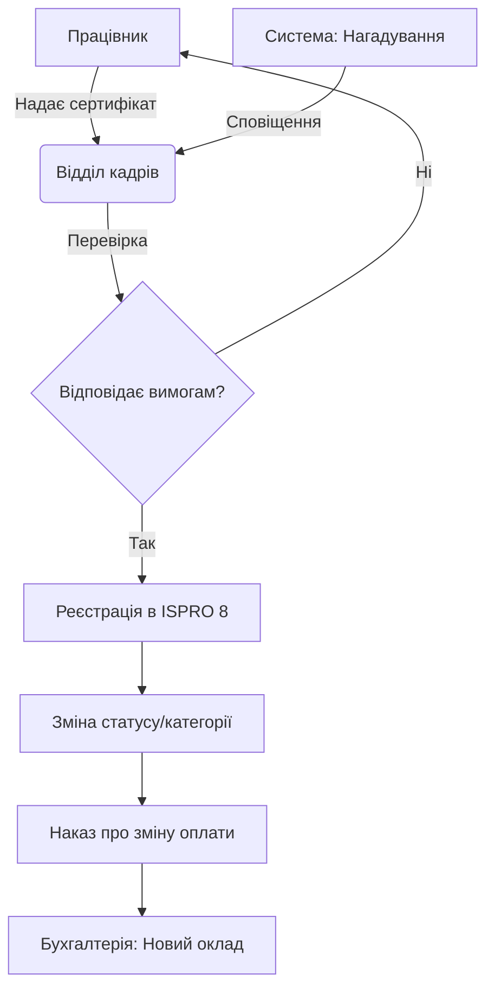

# Підвищення кваліфікації та атестація (Professional Development)

## 1. Опис процесу
Моніторинг термінів підвищення кваліфікації, реєстрація сертифікатів та результатів атестації науково-педагогічних працівників.

## 2. Функціональні вимоги
*   **Моніторинг:** Автоматичне сповіщення про наближення терміну атестації (за 6 місяців).
*   **Реєстрація досягнень:** Введення даних про пройдені курси, стажування, отримані сертифікати.
*   **Зміна категорій:** Автоматичне формування проекту наказу про зміну кваліфікаційної категорії або тарифного розряду.
*   **Звітність:** Формування планів-графіків підвищення кваліфікації на рік.

## 3. Технічні вимоги
*   **Синхронізація з ISPRO 8:** Заповнення розділу "Освіта" та "Кваліфікація" в особовій картці.
*   **Документи:** Можливість прикріплення скан-копій сертифікатів.
*   **Інтеграція:** Дані про зміну категорії повинні автоматично змінювати умови оплати праці.

## 4. Діаграма потоку даних (Mermaid)

## 5. Специфікація інтеграції з ISPRO 8
Дані вносяться до підсистеми "Кадри" -> "Особові картки" -> розділ "Підвищення кваліфікації". При зміні розряду дані передаються до підсистеми "Заробітна плата" для актуалізації розрахункових параметрів.
