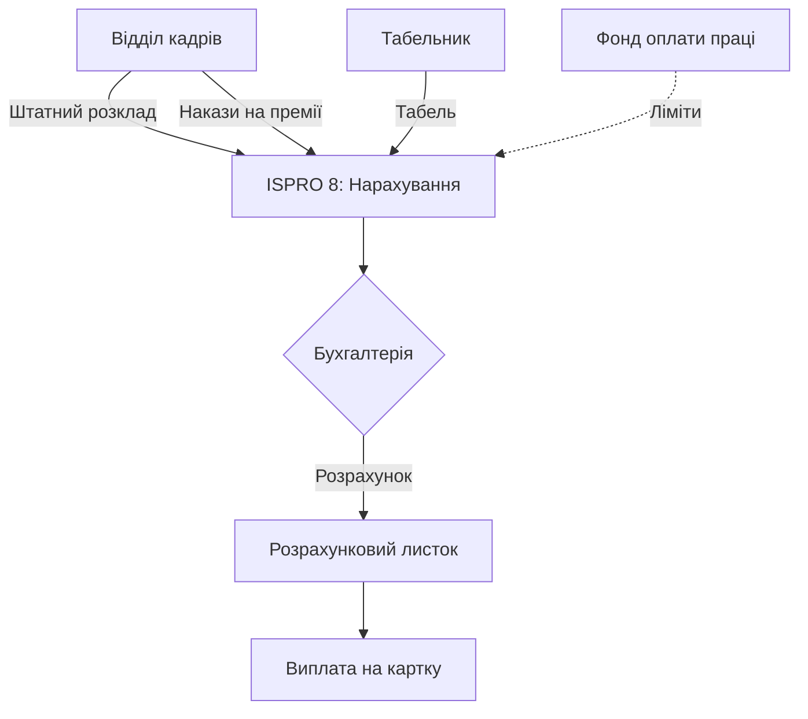

# Інтеграція з фінансовим відділом (Salary Integration)

## 1. Опис процесу
Передача агрегованих даних про відпрацьований час, премії, доплати та утримання з відділу кадрів до бухгалтерії через систему ISPRO 8 для нарахування заробітної плати.

## 2. Функціональні вимоги
*   **Синхронізація нарахувань:** Автоматична передача даних про встановлені оклади та надбавки.
*   **Передача відхилень:** Імпорт даних про відпустки, лікарняні, прогули.
*   **Преміювання:** Модуль введення даних про премії на основі наказів.
*   **Контроль лімітів:** Перевірка відповідності нарахувань фонду оплати праці (ФОП).

## 3. Технічні вимоги
*   **Модулі ISPRO 8:** "Заробітна плата", "Фінансове планування".
*   **Метод інтеграції:** Внутрішні посилання системи ISPRO 8 (між модулем HRM та Payroll).
*   **Періодичність:** Щомісячно перед розрахунковим періодом.

## 4. Діаграма потоку даних (Mermaid)

## 5. Специфікація інтеграції з ISPRO 8
Використання стандартного функціоналу зв'язку між "Картотекою особових рахунків" та "Постійними нарахуваннями". Необхідно налаштувати автоматичне створення "Входів" у розрахункову відомість на основі наказів по персоналу.
